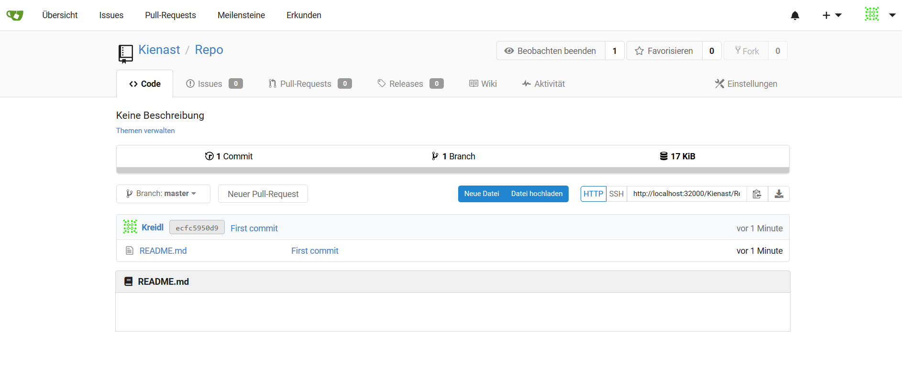

# kubernetes-gitea

Contains deployments and services for gitea 

Is a webbased git tool like GitHub 
Deploys gitea and postgres 
Modify yaml if you need to.

Access on SERVERIP:32000 

On Installation configure URL on the bottom to go to port 32000 

This image shows the repo view 
